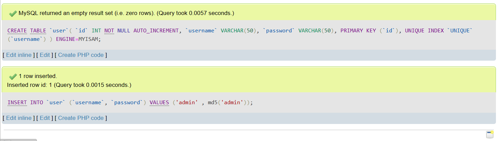

# Lab12Web
## Profil
| Variable | Isi |
| -------- | --- |
| **Nama** | Gilar Sumilar |
| **NIM** | 312210407 |
| **Kelas** | TI.22.A4 |
| **Mata Kuliah** | Pemrograman WEB |

# Sistem Login

# Langkah-langkah Praktikum
## DDL Table User
```sql
CREATE TABLE `user`(
`id` INT NOT NULL AUTO_INCREMENT,
`username` VARCHAR(50),
`password` VARCHAR(50),
PRIMARY KEY (`id`),
UNIQUE INDEX `UNIQUE` (`username`)
) ENGINE=MYISAM;

INSERT INTO `user` (`username`, `password`) VALUES ('admin'
, md5('admin'));
```
**Hasil :**



#### *Note :*
Username : admin

Password : admin

## Login Sesion
```php
<?php
session_start();
if (!isset($_SESSION['isLogin']))
    header('location: login.php');
```
**Hasil :**

#### *Note :*
Fungsi dari login session (sesi masuk) adalah untuk mengamankan akses ke suatu sistem atau aplikasi dengan memerlukan pengguna untuk melakukan otentikasi sebelum dapat menggunakan layanan atau fitur tertentu. Proses login sesi umumnya melibatkan penggunaan kombinasi username (nama pengguna) dan password (kata sandi) sebagai identifikasi unik.

## Login
```php
<?php
session_start();
$title = 'Login Form Sederhana';
include_once 'koneksi.php';
if (isset($_POST['submit'])) {
    $user = $_POST['user'];
    $password = $_POST['password'];

    $sql = "SELECT * FROM user WHERE username = '{$user}'

AND password = md5('{$password}') ";
    $result = mysqli_query($conn, $sql);
    if ($result && mysqli_affected_rows($conn) != 0) {
        $_SESSION['isLogin'] = true;
        $_SESSION['user'] = mysqli_fetch_array($result);
        header('location: index.php');
    } else
        $errorMsg = "<p style=\"color:red;\">Gagal Login,
silakan ulangi lagi.</p>";
}

include_once "header.php";
if (isset($errorMsg))
    echo $errorMsg;
?>

<h2>Login</h2>
<form method="post">
    <div style="margin-bottom: 10px;">
        <label for="user">Username</label>
        <input type="text" name="user" id="user" required>
    </div>
    <div style="margin-bottom: 10px;">
        <label for="password">Password</label>
        <input type="password" name="password" id="password" required>
    </div>
    <div>
        <input type="submit" name="submit" value="Login">
    </div>
</form>
```
**Hasil :**

#### *Note :*

## Login Sederhana

**Hasil :**


